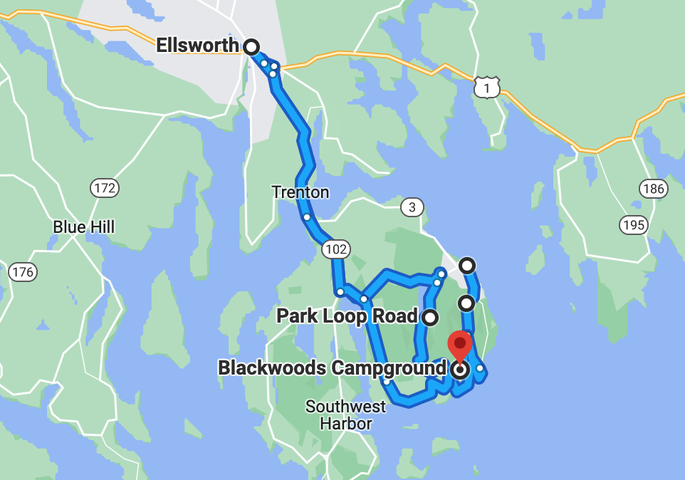
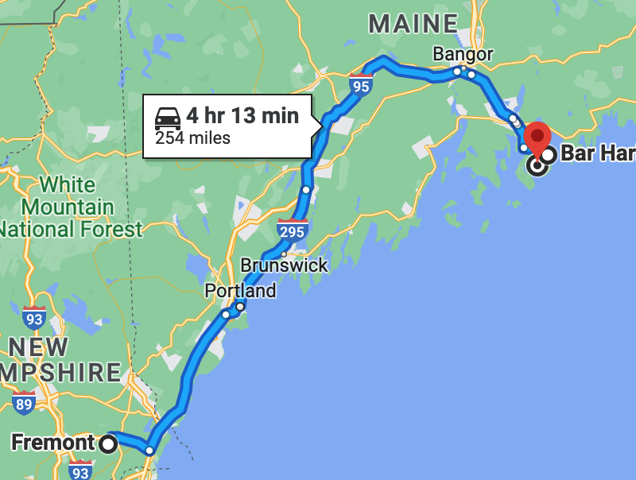

# 🦞  Bar Harbor to Acadia 🌲

#### [<< Previous Post](https://jay-d.me/2016RT-06-26) | [Index](../../README.md) | [Next Post >>](https://jay-d.me/2016RT-06-28)

## Today's Trip
* **Date:** Monday, June 27, 2016
* **Starting Point:** Bluenose Inn, Bar Harbor, Maine
* **Destination:** Blackwoods Campground, Acadia National Park, Maine
* **Distance:** 69 miles
* **Photos:** [06/27 Photos](https://jay-d.me/2016RT-06-27-photos)

##  `EmojiStory`

## Journal Entry

* `Journal Entry`

## The Budget

* $65.50 from previous day
* $60.00 daily addition
* $63.00 expenses
  * $45.00	Campground
  * $10.00	Wood
  * $8.00	Ice & Seam Seal
* End of day total: **$62.50**

## Trip Statistics

* **Total Distance:** 2302 miles
* **Total Budget Spent:** $1150.11
* **U.S. States**
  * New Hampshire
  * Maine
* **Total Trip Map:**

#### [<< Previous Post](https://jay-d.me/2016RT-06-26) | [Index](../../README.md) | [Next Post >>](https://jay-d.me/2016RT-06-28)

