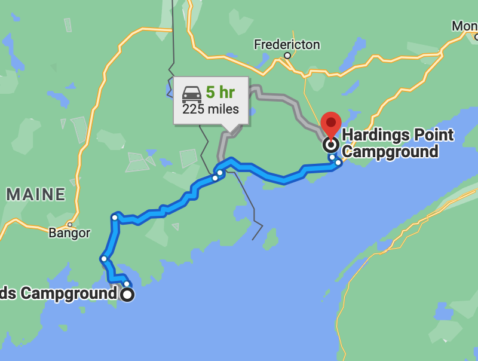

# 🌲  Acadia to Harding's Point 🦫

#### [<< Previous Post](https://jay-d.me/2016RT-06-29) | [Index](../../README.md) | [Next Post >>](https://jay-d.me/2016RT-07-01)

## Today's Trip
* **Date:** Thursday, June 30, 2016
* **Starting Point:** Blackwoods Campground, Acadia National Park, Maine
* **Destination:** Harding's Point Campground, New Brunswick, Canada
* **Distance:** 202 miles
* **Photos:** [06/30 Photos](https://jay-d.me/2016RT-06-30-photos)

##  `EmojiStory`

## Journal Entry

* `Journal Entry`

## The Budget

* $154.50 from previous day
* $60.00 daily addition
* $80.00 expenses
  * $35.00	Campground
  * $31.00	Groceries
  * $14.00	6pk IPA
* End of day total: **$134.50**

## Trip Statistics

* **Total Distance:** 2302 miles
* **Total Budget Spent:** $1150.11
* **U.S. States**
  * New Hampshire
  * Maine
* **Canadian Provinces**
  * New Brunswick
* **Total Trip Map:**

#### [<< Previous Post](https://jay-d.me/2016RT-06-29) | [Index](../../README.md) | [Next Post >>](https://jay-d.me/2016RT-07-01)

