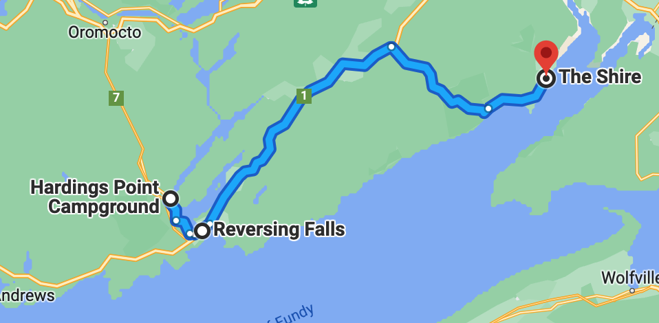
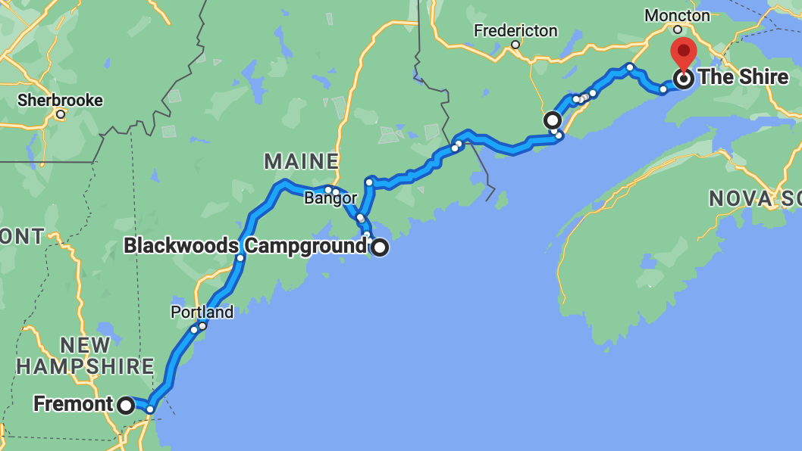

# 🦫  Harding's Point to The Shire 🦟

#### [<< Previous Post](https://jay-d.me/2016RT-06-30) | [Index](../../README.md) | [Next Post >>](https://jay-d.me/2016RT-07-02)

## Today's Trip
* **Date:** Friday, July 01, 2016
* **Starting Point:** Harding's Point Campground, New Brunswick, Canada
* **Destination:** The Shire, New Horton, New Brunswick, Canada
* **Distance:** 139 miles
* **Photos:** [07/01 Photos](https://jay-d.me/2016RT-07-01-photos)

##  `EmojiStory`

## Journal Entry

* `Journal Entry`

## The Budget

* $134.50 from previous day
* $60.00 daily addition
* $59.50 expenses
  * $30.00	Gas
  * $23.00	Beer & Frozen Pizza
  * $6.50	Reversing Falls Admission
* End of day total: **$135.00**

## Trip Statistics

* **Total Distance:** 2302 miles
* **Total Budget Spent:** $1150.11
* **U.S. States**
  * New Hampshire
  * Maine
* **Canadian Provinces**
  * New Brunswick
* **Total Trip Map:**

#### [<< Previous Post](https://jay-d.me/2016RT-06-30) | [Index](../../README.md) | [Next Post >>](https://jay-d.me/2016RT-07-02)

