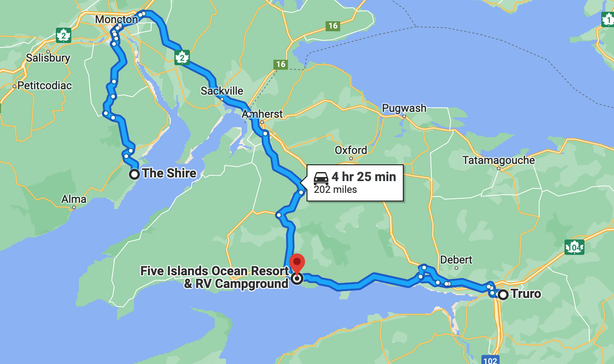
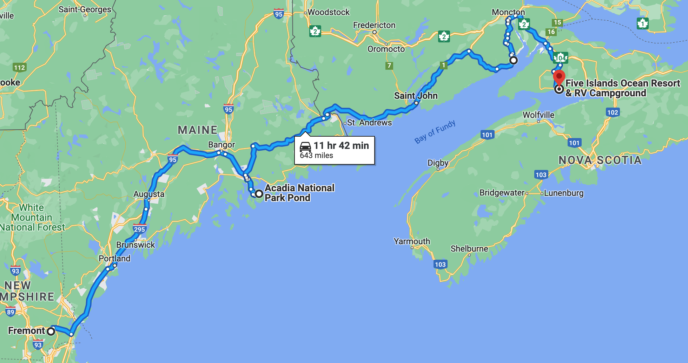

# 🦟  The Shire to Five Islands 🏝

#### [<< Previous Post](https://jay-d.me/2016RT-07-01) | [Index](../../README.md) | [Next Post >>](https://jay-d.me/2016RT-07-03)

## Today's Trip
* **Date:** Saturday, July 02, 2016
* **Starting Point:** The Shire, New Horton, New Brunswick, Canada
* **Destination:** Five Islands Resort & RV Park, Lower Five Islands, Nova Scotia, Canada
* **Distance:** 202 miles
* **Photos:** [07/02 Photos](https://jay-d.me/2016RT-07-02-photos)

##  `EmojiStory`

## Journal Entry

* `Journal Entry`

## The Budget

* $135.00 from previous day
* $60.00 daily addition
* $102.00 expenses
  * $35.00	Groceries
  * $31.00	Campground
  * $30.00	Walmart Run
  * $6.00	Wood
* End of day total: **$93.00**

## Trip Statistics

* **Total Distance:** 2302 miles
* **Total Budget Spent:** $1150.11
* **U.S. States**
  * New Hampshire
  * Maine
* **Canadian Provinces**
  * New Brunswick
  * Nova Scotia
* **Total Trip Map:**

#### [<< Previous Post](https://jay-d.me/2016RT-07-01) | [Index](../../README.md) | [Next Post >>](https://jay-d.me/2016RT-07-03)

