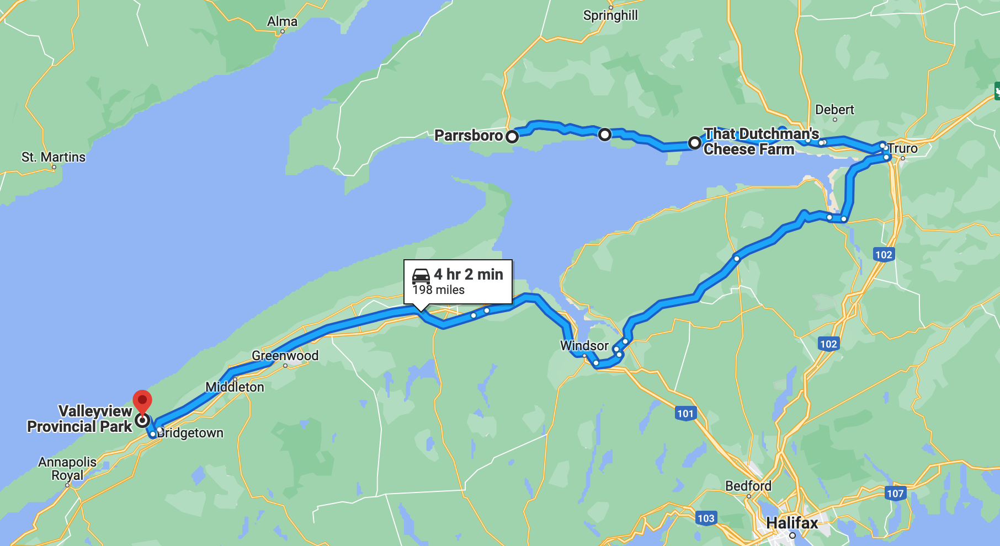

# 🏝  Five Islands to Valley View 🖼

#### [<< Previous Post](https://jay-d.me/2016RT-07-02) | [Index](../../README.md) | [Next Post >>](https://jay-d.me/2016RT-07-04)

## Today's Trip
* **Date:** Sunday, July 03, 2016
* **Starting Point:** Five Islands Resort & RV Park, Lower Five Islands, Nova Scotia, Canada
* **Destination:** Valley View Provincial Park, Hampton, Nova Scotia, Canada
* **Distance:** 198 miles
* **Photos:** [07/03 Photos](https://jay-d.me/2016RT-07-03-photos)

##  `EmojiStory`

## Journal Entry

* `Journal Entry`

## The Budget

* $93.00 from previous day
* $60.00 daily addition
* $85.50 expenses
  * $41.00	Gas
  * $23.00	Campsite
  * $13.00	Cheese
  * $8.50	Fish & Ice
* End of day total: **$67.50**

## Trip Statistics

* **Total Distance:** 2302 miles
* **Total Budget Spent:** $1150.11
* **U.S. States**
  * New Hampshire
  * Maine
* **Canadian Provinces**
  * New Brunswick
  * Nova Scotia
* **Total Trip Map:**

#### [<< Previous Post](https://jay-d.me/2016RT-07-02) | [Index](../../README.md) | [Next Post >>](https://jay-d.me/2016RT-07-04)

