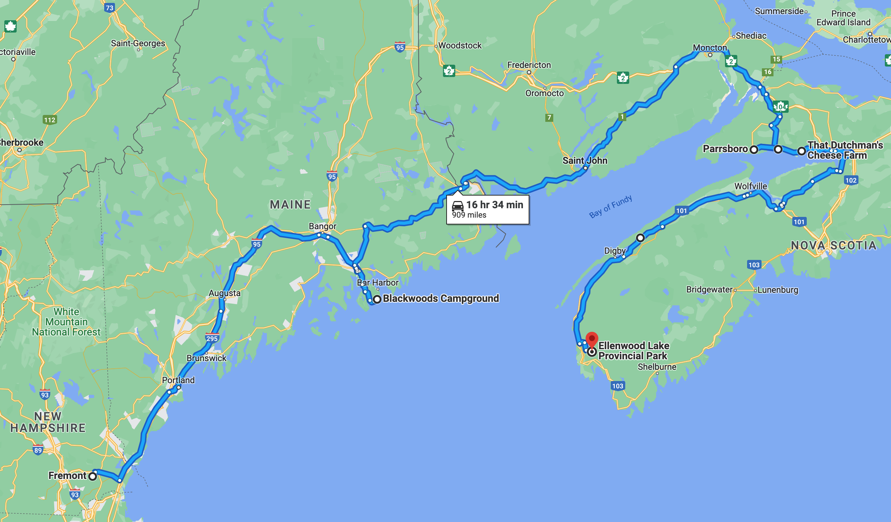

# 🖼  Valley View to Ellenwood Lake 🐥

#### [<< Previous Post](https://jay-d.me/2016RT-07-05) | [Index](../../README.md) | [Next Post >>](https://jay-d.me/2016RT-07-07)

## Today's Trip
* **Date:** Wednesday, July 06, 2016
* **Starting Point:** Valley View Provincial Park, Hampton, Nova Scotia, Canada
* **Destination:** Ellenwood Lake Provincial Park, Yarmouth, Nova Scotia, Canada
* **Distance:** 125 miles
* **Photos:** [07/06 Photos](https://jay-d.me/2016RT-07-06-photos)

##  `EmojiStory`

## Journal Entry

* `Journal Entry`

## The Budget

* $-3.50 from previous day
* $60.00 daily addition
* $75.50 expenses
  * $19.00	Camp Supplies
  * $27.00	Groceries
  * $27.00	Campsite
  * $2.50	Camp Supplies
* End of day total: **$-19.00**

## Trip Statistics

* **Total Distance:** 2302 miles
* **Total Budget Spent:** $1150.11
* **U.S. States**
  * New Hampshire
  * Maine
* **Canadian Provinces**
  * New Brunswick
  * Nova Scotia
* **Total Trip Map:**

#### [<< Previous Post](https://jay-d.me/2016RT-07-05) | [Index](../../README.md) | [Next Post >>](https://jay-d.me/2016RT-07-07)

