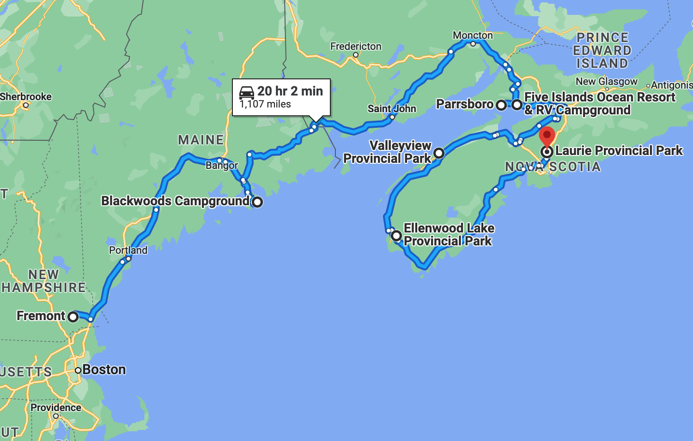

# 🐥  Ellenwood Lake to Laurie 🐿

#### [<< Previous Post](https://jay-d.me/2016RT-07-07) | [Index](../../README.md) | [Next Post >>](https://jay-d.me/2016RT-07-09)

## Today's Trip
* **Date:** Friday, July 08, 2016
* **Starting Point:** Ellenwood Lake Provincial Park, Yarmouth, Nova Scotia, Canada
* **Destination:** Laurie Provincial Park, Grand Lake, Nova Scotia, Canada
* **Distance:** 251 miles
* **Photos:** [07/08 Photos](https://jay-d.me/2016RT-07-08-photos)

##  `EmojiStory`

## Journal Entry

* `Journal Entry`

## The Budget

* $99.18 from previous day
* $60.00 daily addition
* $76.03 expenses
  * $32.00	Whiskey & Tall Boy
  * $26.70	Campsite
  * $19.00	Pizza
  * $10.00	Ice & Wood
  * $8.00	Hot Water Bottle
  * $-19.67	Budget Audit
* End of day total: **$83.15**

## Trip Statistics

* **Total Distance:** 2302 miles
* **Total Budget Spent:** $1150.11
* **U.S. States**
  * New Hampshire
  * Maine
* **Canadian Provinces**
  * New Brunswick
  * Nova Scotia
* **Total Trip Map:**

#### [<< Previous Post](https://jay-d.me/2016RT-07-07) | [Index](../../README.md) | [Next Post >>](https://jay-d.me/2016RT-07-09)

