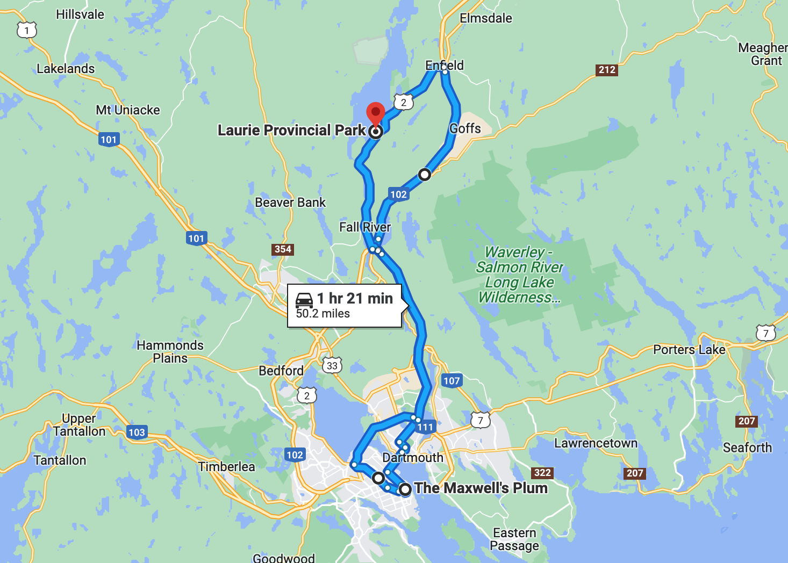
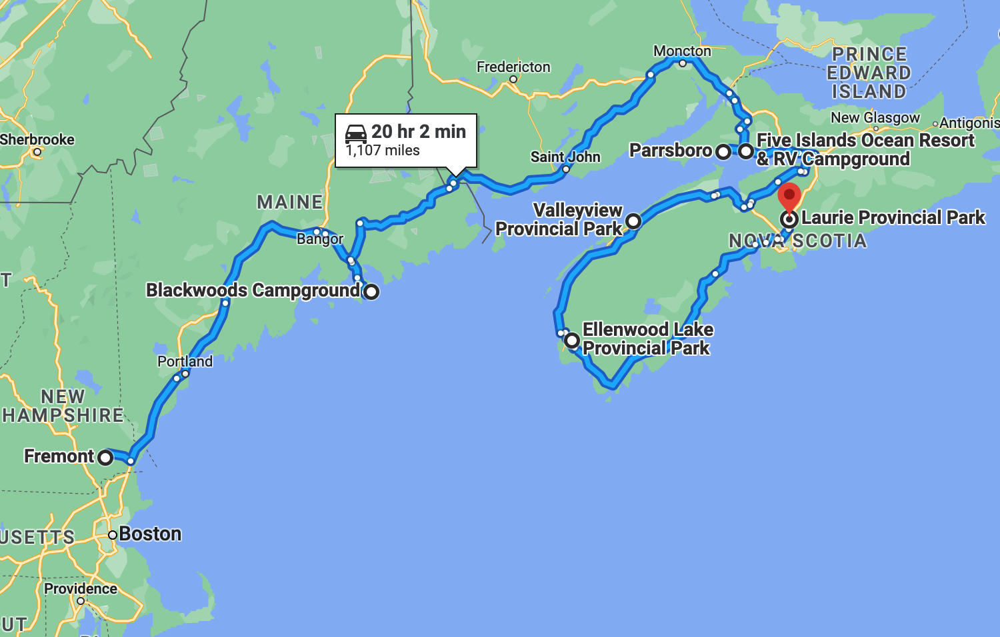

# 🐿  Laurie 🐿

#### [<< Previous Post](https://jay-d.me/2016RT-07-08) | [Index](../../README.md) | [Next Post >>](https://jay-d.me/2016RT-07-10)

## Today's Trip
* **Date:** Saturday, July 09, 2016
* **Starting Point:** Laurie Provincial Park, Grand Lake, Nova Scotia, Canada
* **Destination:** Laurie Provincial Park, Grand Lake, Nova Scotia, Canada
* **Distance:** 52 miles
* **Photos:** [07/09 Photos](https://jay-d.me/2016RT-07-09-photos)

##  `EmojiStory`

## Journal Entry

* `Journal Entry`

## The Budget

* $83.15 from previous day
* $60.00 daily addition
* $125.95 expenses
  * $51.00	Groceries
  * $45.00	Pub - Beer & Nachos
  * $26.70	Campsite
  * $3.25	NS Flag Sticker
* End of day total: **$17.20**

## Trip Statistics

* **Total Distance:** 2302 miles
* **Total Budget Spent:** $1150.11
* **U.S. States**
  * New Hampshire
  * Maine
* **Canadian Provinces**
  * New Brunswick
  * Nova Scotia
* **Total Trip Map:**

#### [<< Previous Post](https://jay-d.me/2016RT-07-08) | [Index](../../README.md) | [Next Post >>](https://jay-d.me/2016RT-07-10)

