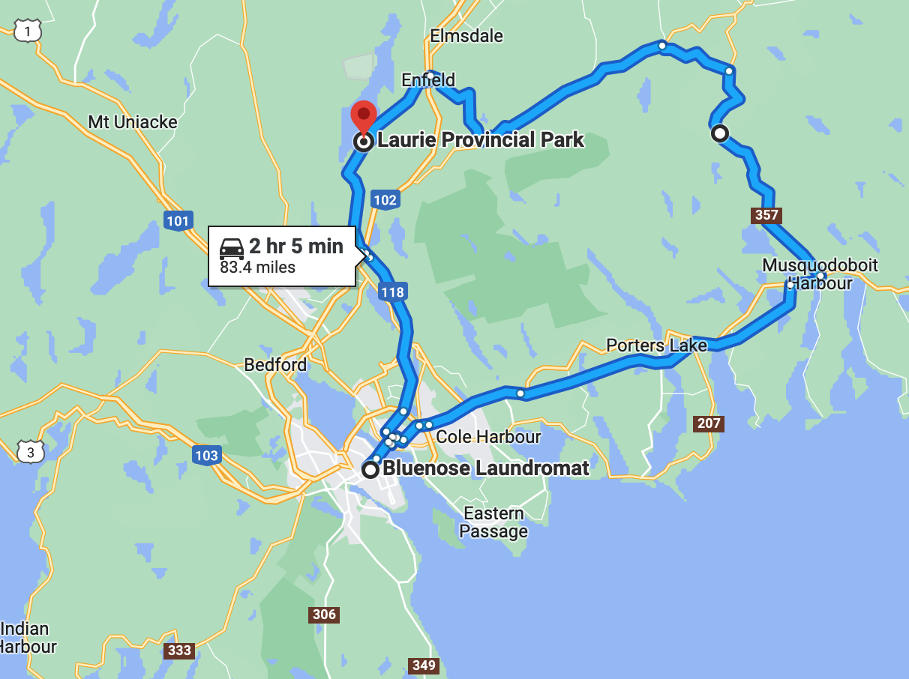

# 🐿  Laurie 🐿

#### [<< Previous Post](https://jay-d.me/2016RT-07-09) | [Index](../../README.md) | [Next Post >>](https://jay-d.me/2016RT-07-11)

## Today's Trip
* **Date:** Sunday, July 10, 2016
* **Starting Point:** Laurie Provincial Park, Grand Lake, Nova Scotia, Canada
* **Destination:** Laurie Provincial Park, Grand Lake, Nova Scotia, Canada
* **Distance:** 83 miles
* **Photos:** [07/10 Photos](https://jay-d.me/2016RT-07-10-photos)

##  `EmojiStory`

## Journal Entry

* `Journal Entry`

## The Budget

* $17.20 from previous day
* $60.00 daily addition
* $77.40 expenses
  * $26.70	Campsite
  * $22.00	Mussels & Beer
  * $19.00	Beet Cider Growler
  * $8.00	Laundry
  * $1.70	Coffee Crisp
* End of day total: **$-0.20**

## Trip Statistics

* **Total Distance:** 2302 miles
* **Total Budget Spent:** $1150.11
* **U.S. States**
  * New Hampshire
  * Maine
* **Canadian Provinces**
  * New Brunswick
  * Nova Scotia
* **Total Trip Map:**

#### [<< Previous Post](https://jay-d.me/2016RT-07-09) | [Index](../../README.md) | [Next Post >>](https://jay-d.me/2016RT-07-11)

