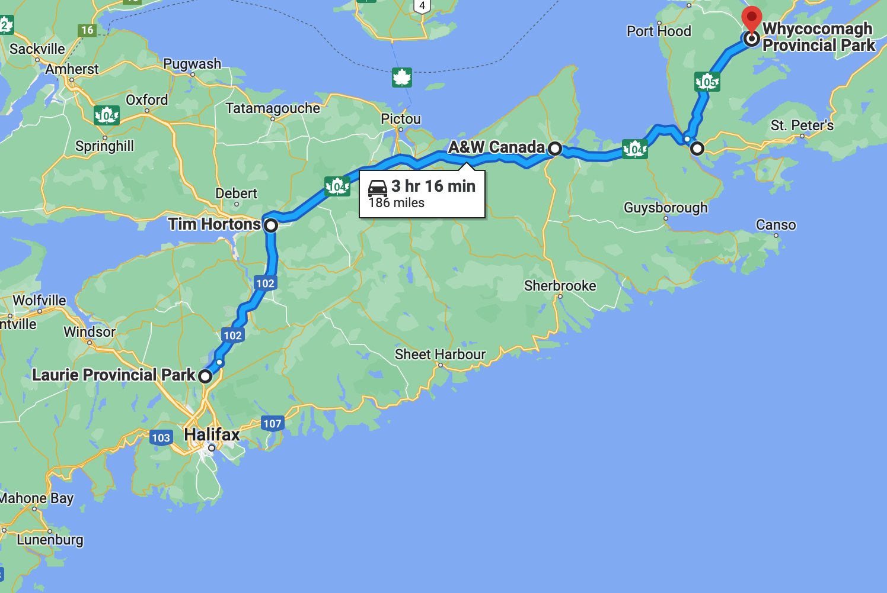
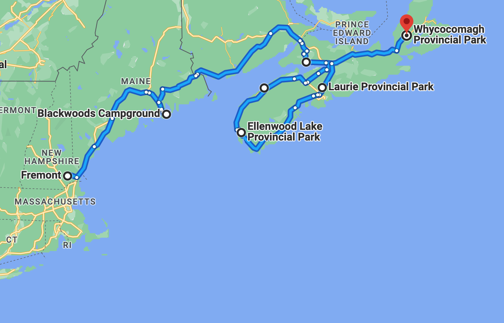

# 🐿  Laurie to Whycocomagh 🗿

#### [<< Previous Post](https://jay-d.me/2016RT-07-10) | [Index](../../README.md) | [Next Post >>](https://jay-d.me/2016RT-07-12)

## Today's Trip
* **Date:** Monday, July 11, 2016
* **Starting Point:** Laurie Provincial Park, Grand Lake, Nova Scotia, Canada
* **Destination:** Whycocomagh Provincial Park, Whycocomagh, Nova Scotia, Canada
* **Distance:** 186 miles
* **Photos:** [07/11 Photos](https://jay-d.me/2016RT-07-11-photos)

##  `EmojiStory`

## Journal Entry

* `Journal Entry`

## The Budget

* $-0.20 from previous day
* $60.00 daily addition
* $68.71 expenses
  * $26.70	Campsite
  * $19.70	Groceries
  * $13.71	A&W
  * $5.00	Wood
  * $3.60	Tim Horton's
* End of day total: **$-8.91**

## Trip Statistics

* **Total Distance:** 2302 miles
* **Total Budget Spent:** $1150.11
* **U.S. States**
  * New Hampshire
  * Maine
* **Canadian Provinces**
  * New Brunswick
  * Nova Scotia
* **Total Trip Map:**

#### [<< Previous Post](https://jay-d.me/2016RT-07-10) | [Index](../../README.md) | [Next Post >>](https://jay-d.me/2016RT-07-12)

