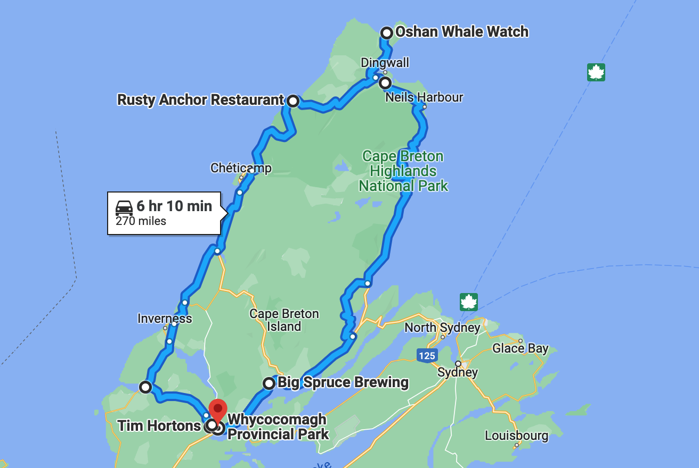
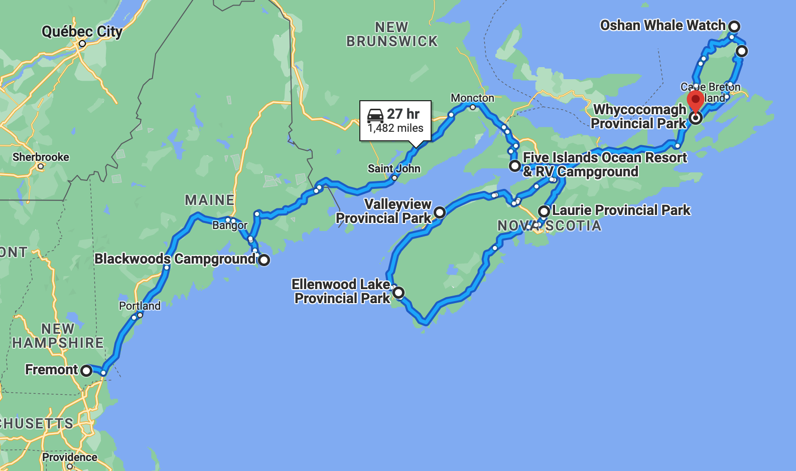

# 🗿  Whycocomagh 🗿

#### [<< Previous Post](https://jay-d.me/2016RT-07-11) | [Index](../../README.md) | [Next Post >>](https://jay-d.me/2016RT-07-13)

## Today's Trip
* **Date:** Tuesday, July 12, 2016
* **Starting Point:** Whycocomagh Provincial Park, Whycocomagh, Nova Scotia, Canada
* **Destination:** Whycocomagh Provincial Park, Whycocomagh, Nova Scotia, Canada
* **Distance:** 270 miles
* **Photos:** [07/12 Photos](https://jay-d.me/2016RT-07-12-photos)

##  `EmojiStory`

## Journal Entry

* `Journal Entry`

## The Budget

* $-8.91 from previous day
* $60.00 daily addition
* $121.20 expenses
  * $55.50	The Rusty Anchor
  * $26.70	Campsite
  * $19.00	Growler @ Big Spruce
  * $15.80	Park Access
  * $4.20	Tim Horton's
* End of day total: **$-70.11**

## Trip Statistics

* **Total Distance:** 2302 miles
* **Total Budget Spent:** $1150.11
* **U.S. States**
  * New Hampshire
  * Maine
* **Canadian Provinces**
  * New Brunswick
  * Nova Scotia
* **Canadian National Parks**
  * Cape Breton Highlands
* **Total Trip Map:**

#### [<< Previous Post](https://jay-d.me/2016RT-07-11) | [Index](../../README.md) | [Next Post >>](https://jay-d.me/2016RT-07-13)

